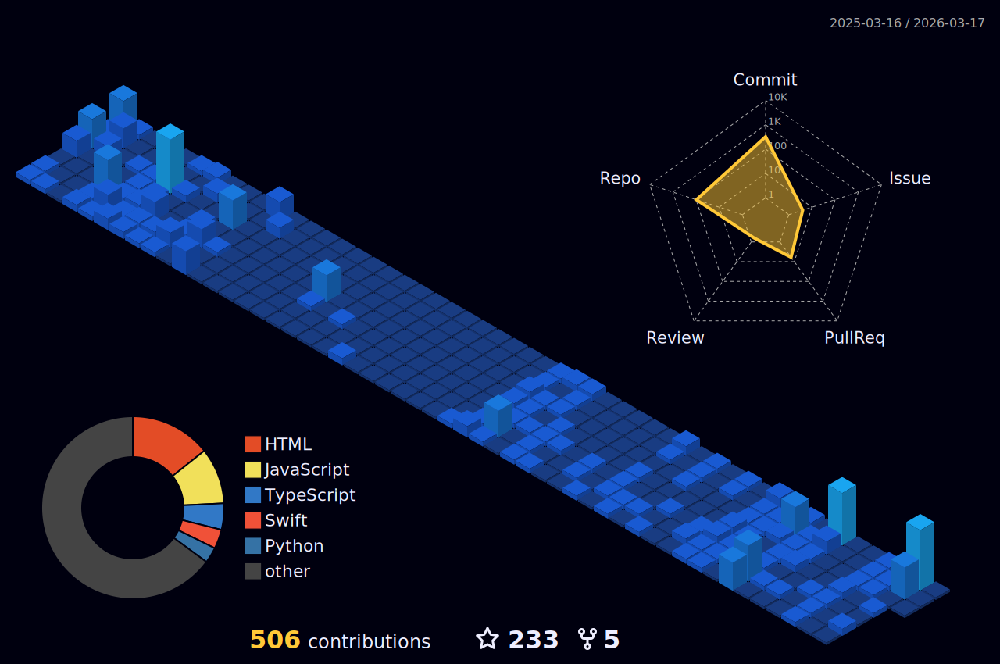

<!--   my-icons -->

    

  

 

  

 
 

 

  
 
 

 

 

   
<h1 align="center">
    
  

  

</h1>
<!-- Proudly created with GPRM ( https://gprm.itsvg.in ) -->

 

 
 
 

  
  
  
  
  
  
  
  
  
  

 
 

  &nbsp;&nbsp;

  &nbsp;&nbsp;

  &nbsp;&nbsp;

  

 
 
   
  
                                                                                                                                                                                                                                                                                                                                                                                        

